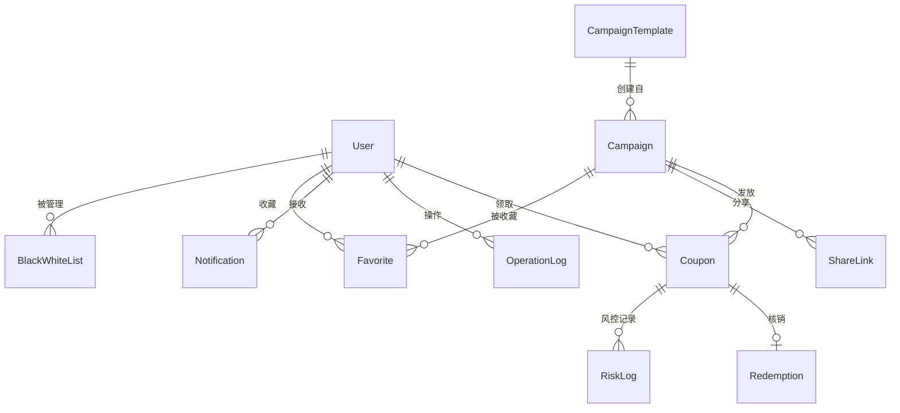

# 数据库设计

## 1. ER关系图



## 2. 数据表设计

### 2.1 User（用户表）

| 字段 | 类型 | 约束 | 说明 |
|------|------|------|------|
| id | String (CUID) | PK | 用户ID |
| username | String | UNIQUE, NOT NULL | 用户名 |
| passwordHash | String | NOT NULL | bcrypt哈希密码 |
| role | Enum | NOT NULL | 角色: ADMIN/OPERATOR/VERIFIER/USER |
| createdAt | DateTime | DEFAULT now() | 注册时间 |

索引：username (UNIQUE)

---

### 2.2 Campaign（活动表）

| 字段 | 类型 | 约束 | 说明 |
|------|------|------|------|
| id | String (CUID) | PK | 活动ID |
| name | String | NOT NULL | 活动名称 |
| description | String | | 活动描述 |
| type | Enum | NOT NULL | 类型: FULL_REDUCTION/DISCOUNT/NO_THRESHOLD/ADD_ON/CATEGORY/NEWCOMER/TIME_LIMITED |
| params | JSON | NOT NULL | 类型相关参数 |
| totalStock | Int | NOT NULL | 总库存 |
| remainingStock | Int | NOT NULL | 剩余库存 |
| limitPerUser | Int | NOT NULL, DEFAULT 1 | 每人限领 |
| validityMode | Enum | NOT NULL | 有效期模式: RELATIVE/FIXED |
| validityDays | Int | | 相对模式：领取后N天有效 |
| fixedStartDate | DateTime | | 固定模式：开始日期 |
| fixedEndDate | DateTime | | 固定模式：结束日期 |
| startTime | DateTime | | 活动开放领取时间 |
| transferable | Boolean | DEFAULT false | 是否可转赠 |
| stackable | Boolean | DEFAULT false | 是否可叠加 |
| shareable | Boolean | DEFAULT false | 是否可分享 |
| shareLimit | Int | DEFAULT 3 | 分享领取次数上限 |
| templateId | String | FK (nullable) | 来源模板 |
| createdBy | String | FK → User.id | 创建人 |
| createdAt | DateTime | DEFAULT now() | 创建时间 |
| updatedAt | DateTime | | 最后修改时间 |

索引：createdBy, type, startTime

---

### 2.3 Coupon（优惠券实例表）

| 字段 | 类型 | 约束 | 说明 |
|------|------|------|------|
| id | String (CUID) | PK | 券ID |
| couponCode | String | UNIQUE, NOT NULL | 唯一券码 (CPN-XXXXXXXX) |
| campaignId | String | FK → Campaign.id | 所属活动 |
| userId | String | FK → User.id | 持有用户 |
| status | Enum | NOT NULL | 状态: CLAIMED/REDEEMED/EXPIRED/TRANSFERRED |
| claimedAt | DateTime | NOT NULL | 领取时间 |
| expiresAt | DateTime | NOT NULL | 过期时间 |
| usedAt | DateTime | | 核销时间 |
| transferredFrom | String | FK → User.id (nullable) | 转赠来源用户 |
| createdAt | DateTime | DEFAULT now() | 记录创建时间 |

索引：couponCode (UNIQUE), campaignId+userId, userId+status, expiresAt

---

### 2.4 Redemption（核销记录表）

| 字段 | 类型 | 约束 | 说明 |
|------|------|------|------|
| id | String (CUID) | PK | 记录ID |
| couponId | String | FK → Coupon.id, UNIQUE | 优惠券 |
| couponCode | String | NOT NULL | 券码（冗余，方便查询） |
| redeemedBy | String | FK → User.id | 核销人员 |
| redeemedAt | DateTime | DEFAULT now() | 核销时间 |

索引：couponId (UNIQUE), redeemedBy

---

### 2.5 ShareLink（分享链接表）

| 字段 | 类型 | 约束 | 说明 |
|------|------|------|------|
| id | String (CUID) | PK | 链接ID |
| campaignId | String | FK → Campaign.id | 活动 |
| createdBy | String | FK → User.id | 分享人 |
| shareCode | String | UNIQUE, NOT NULL | 分享码 |
| maxClaims | Int | NOT NULL | 最大可领次数 |
| currentClaims | Int | DEFAULT 0 | 当前已领次数 |
| expiresAt | DateTime | | 链接过期时间 |
| createdAt | DateTime | DEFAULT now() | 创建时间 |

索引：shareCode (UNIQUE)

---

### 2.6 RiskLog（风控记录表）

| 字段 | 类型 | 约束 | 说明 |
|------|------|------|------|
| id | String (CUID) | PK | 记录ID |
| userId | String | FK → User.id | 用户 |
| action | String | NOT NULL | 触发动作 |
| score | Int | NOT NULL | 风险评分(0-100) |
| decision | Enum | NOT NULL | 决策: ALLOW/BLOCK/REVIEW |
| reason | String | NOT NULL | 原因 |
| ruleTriggered | String | | 触发的规则编号 |
| aiExplanation | String | | AI解释文本 |
| createdAt | DateTime | DEFAULT now() | 记录时间 |

索引：userId, decision, createdAt

---

### 2.7 OperationLog（操作日志表）

| 字段 | 类型 | 约束 | 说明 |
|------|------|------|------|
| id | String (CUID) | PK | 日志ID |
| userId | String | FK → User.id | 操作人 |
| action | String | NOT NULL | 操作类型 |
| target | String | | 目标对象 |
| detail | String | | 详情JSON |
| createdAt | DateTime | DEFAULT now() | 操作时间 |

索引：userId, action, createdAt

---

### 2.8 Notification（通知表）

| 字段 | 类型 | 约束 | 说明 |
|------|------|------|------|
| id | String (CUID) | PK | 通知ID |
| userId | String | FK → User.id | 接收用户 |
| type | String | NOT NULL | 通知类型 |
| content | String | NOT NULL | 通知内容 |
| read | Boolean | DEFAULT false | 是否已读 |
| createdAt | DateTime | DEFAULT now() | 创建时间 |

索引：userId+read, createdAt

---

### 2.9 BlackWhiteList（黑白名单表）

| 字段 | 类型 | 约束 | 说明 |
|------|------|------|------|
| id | String (CUID) | PK | 记录ID |
| userId | String | FK → User.id | 目标用户 |
| type | Enum | NOT NULL | 类型: BLACK/WHITE |
| reason | String | NOT NULL | 原因 |
| createdBy | String | FK → User.id | 操作人 |
| createdAt | DateTime | DEFAULT now() | 创建时间 |

索引：userId+type (UNIQUE)

---

### 2.10 CampaignTemplate（活动模板表）

| 字段 | 类型 | 约束 | 说明 |
|------|------|------|------|
| id | String (CUID) | PK | 模板ID |
| name | String | NOT NULL | 模板名称 |
| config | JSON | NOT NULL | 模板配置（活动全部参数） |
| createdBy | String | FK → User.id | 创建人 |
| createdAt | DateTime | DEFAULT now() | 创建时间 |

---

### 2.11 Favorite（收藏表）

| 字段 | 类型 | 约束 | 说明 |
|------|------|------|------|
| id | String (CUID) | PK | 收藏ID |
| userId | String | FK → User.id | 用户 |
| campaignId | String | FK → Campaign.id | 活动 |
| createdAt | DateTime | DEFAULT now() | 收藏时间 |

索引：userId+campaignId (UNIQUE)

---

## 3. 枚举定义

```prisma
enum Role {
  ADMIN
  OPERATOR
  VERIFIER
  USER
}

enum CouponType {
  FULL_REDUCTION    // 满减
  DISCOUNT          // 折扣
  NO_THRESHOLD      // 无门槛
  ADD_ON            // 加购
  CATEGORY          // 品类
  NEWCOMER          // 新人
  TIME_LIMITED      // 限时
}

enum ValidityMode {
  RELATIVE  // 领取后N天
  FIXED     // 固定日期
}

enum CouponStatus {
  CLAIMED      // 已领取/待使用
  REDEEMED     // 已核销
  EXPIRED      // 已过期
  TRANSFERRED  // 已转赠
}

enum RiskDecision {
  ALLOW   // 放行
  BLOCK   // 拦截
  REVIEW  // 人工审核
}

enum ListType {
  BLACK  // 黑名单
  WHITE  // 白名单
}
```

## 4. 关键约束

- Campaign.remainingStock >= 0（库存不可为负）
- 领券时使用事务：WHERE remainingStock > 0 AND 用户未超限领数
- Coupon.couponCode 全局唯一
- Redemption.couponId 唯一（一券只能核销一次）
- Favorite: userId + campaignId 联合唯一
- BlackWhiteList: userId + type 联合唯一

## 5. 数据迁移策略

- 使用 Prisma Migrate 管理 schema 变更
- 初始迁移创建所有表
- 种子数据(seed)：预置示例活动 + 各角色测试账号
